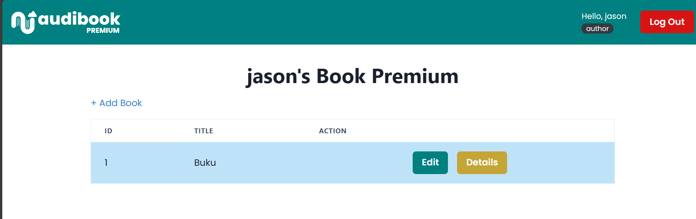

# audiobook-premium-app: The Frontend for AudiBook Premium App

## Introduction

audibook-premium-app adalah frontend dari aplikasi AudiBook Premium yang digunakan oleh curator untuk mengelola permintaan subscription dari user AudiBook App dan pengelolaan buku premium oleh author. Aplikasi ini dibuat dengan menggunakan React + Typescript. Aplikasi ini dibuat untuk memenuhi tugas besar mata kuliah Pemrograman Aplikasi Berbasis Web.

## Overview Feature

- Chakra UI
- Toast
- Dockerized
- Responsive design
- HTTP Client with Axios

## Screenshot

### Login Page

### Register Page

### Add Premium Book

### Edit Premium Book

### My Premium Book

### Book Details

### Premium Book List

### My Book Collection

### Book Collection List

### Subscription Request Page

### 404 Page

## Cara menjalankan aplikasi

Alternatif 1:

1. Pastikan sudah terinstall NodeJS
2. clone repositori ini
3. Buat file `.env` pada root folder aplikasi mengikuti contoh .env.example
4. Install dependency dengan menjalankan perintah `npm install`
5. Jalankan aplikasi dalam mode development dengan `npm run build`
6. Atau, dalam mode production, `npm start`

### Pembagian Tugas

1. Login: 13521100
2. Register: 13521100
3. My Premium Book: 13521100
4. Book Details: 10023327, 13521100
5. Premium Book List: 13521100
6. My Book Collection: 13521100
7. Book Collection List: 13521100
8. Subscription Request Page: 13521085, 13521100
9. 404 Page: 13521100
10. Unauthorized Page: 13521100

## Anggota Kelompok

| Nama                   | NIM      | Panggilan |
| ---------------------- | -------- | --------- |
| Alexander Jason | 13521100 | Jason     |
| Addin Munawwar          | 13521085 | Addin  |
| Syahrul Halik     | 10023327 | Syahrul     |